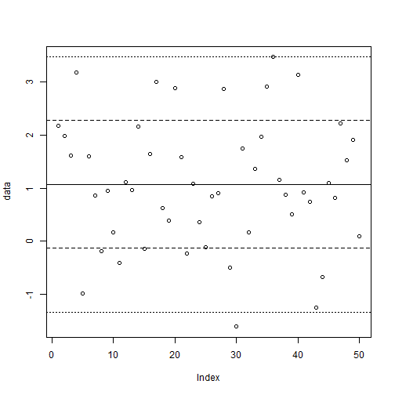
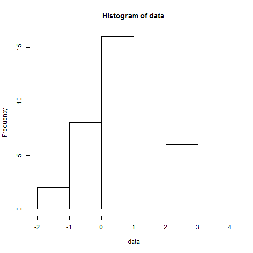

This is a demonstration script that is used for showing how the 
knitr::spin function can be used to run an R script file, producing 
an HTML file that contains

  * The R commands from the script
  * The output of these commands
  * All the plots produced by these commands

This HTML file can then be viewed with a browser.  This procedure
has two advantages:

  1. All the results get put in a single file.
  2. You can put in "markdown" comments, like these, that 
     become nicely formatted text, with bullet points like above, 
     or numbered points like here.


```r
> # Read a file of numbers from the course web page, and show them all.
> 
> data <- scan ("http://www.cs.utoronto.ca/~radford/csc121/data2")
> data
```

```
 [1]  2.170  1.985  1.616  3.181 -0.978  1.597  0.862 -0.186  0.956  0.169
[11] -0.403  1.107  0.965  2.155 -0.141  1.647  3.007  0.631  0.393  2.883
[21]  1.588 -0.228  1.078  0.355 -0.113  0.852  0.913  2.876 -0.499 -1.607
[31]  1.749  0.167  1.366  1.976  2.907  3.470  1.162  0.871  0.506  3.138
[41]  0.920  0.743 -1.242 -0.678  1.104  0.817  2.226  1.521  1.915  0.095
```

```r
> # Compute the sample mean and sample standard deviation of the data.
> 
> m <- mean(data)
> s <- sd(data)
> 
> cat("mean:",m,"  standard deviation:",s,"\n")
```

```
mean: 1.07128   standard deviation: 1.205056 
```

```r
> # Plot the data points, along with a horizontal line at the mean, two 
> # dashed lines at the mean plus and minus the standard deviation, and 
> # two dotted lines at mean plus and minus twice the standard deviation.
> 
> plot(data)
> 
> abline (h=m)
> abline (h=c(m-s,m+s), lty="dashed")
> abline (h=c(m-2*s,m+2*s), lty="dotted")
```



```r
> # Plot a histogram of the data.
> 
> hist(data)
```



That's all!
